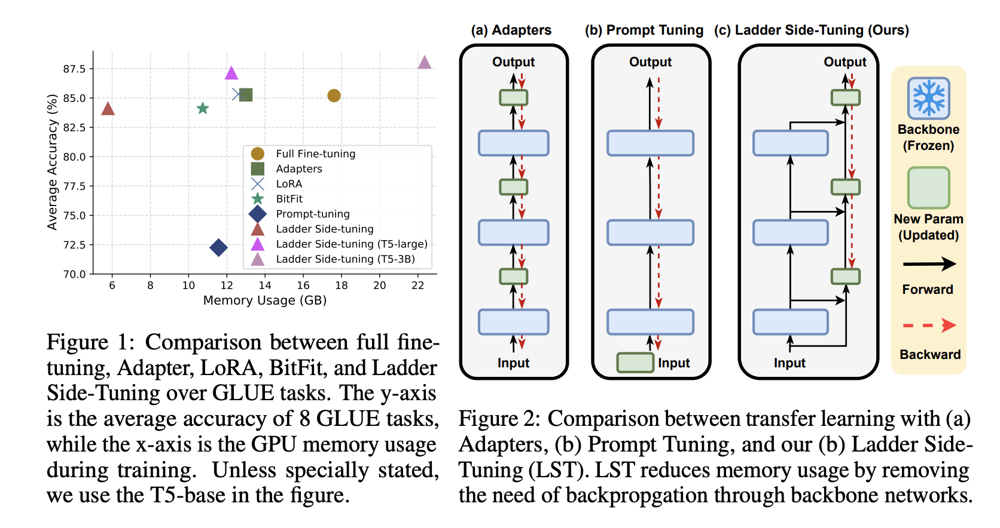

# Ladder Side-Tuning (LST)

* Authors: [Yi-Lin Sung](https://ylsung.github.io/), [Jaemin Cho](https://j-min.io/), [Mohit Bansal](https://www.cs.unc.edu/~mbansal/)
* Paper: ["LST: Ladder Side-Tuning for Parameter and Memory Efficient Transfer Learning"](https://arxiv.org/abs/2206.06522)

We propose Ladder Side-Tuning (LST), a new parameter-efficient transfer learning (PETL) technique that reduces training memory requirements by more substantial amounts. Unlike existing PETL methods that insert additional parameters inside backbone networks, we train a ladder side network, a small and separate network that takes intermediate activations as input via shortcut connections (ladders) from backbone networks and makes predictions.

On both GLUE and VL tasks, LST saves 2.7x more memory than other PETL methods. To further show the advantage of this better memory efficiency, we also apply LST to larger T5 models (T5-large, T5-3B), attaining better GLUE performance than full fine-tuning and other PETL methods. 



## Run GLUE Experiments

### Installation
```bash
cd Ladder-Side-Tuning
pip install -e .
# Install pacakge for network pruning
cd Torch-Pruning
pip install -e .

pip install torch==1.10.2+cu111 torchvision==0.11.3+cu111 -f https://download.pytorch.org/whl/torch_stable.html
```

### Commands

```bash
# All commands are run under seq2seq/
cd seq2seq

## [Table 1]
# Run experiments for 3 seeds, where [Script.sh] is one of "scripts/baseline.sh", "scripts/adapters.sh", "scripts/lora.sh", "scripts/bitfit.sh", "scripts/prompt-tuning.sh", "scripts/ladder_side_tuning_base.sh", "scripts/ladder_side_tuning_large.sh" and "scripts/ladder_side_tuning_3b.sh"
# [GPU ID] = "0", "0,1", "2,3,4", etc

for task in "cola" "mrpc" "qnli" "rte" "sst2" "mnli" "qqp" "stsb"
do
    bash [Script.sh] [GPU ID] $task
done

## [Table 2]
# Run experiments (except stsb) for 3 seeds.

for task in "cola" "mrpc" "qnli" "rte" "sst2" "mnli" "qqp" 
do
    bash scripts/ladder_side_tuning_bart.sh [GPU ID] $task
done

## [Figure 5]
# Change the task_reduction_factor in scripts/adapters.sh, lora_dim in scripts/lora.sh, r in scripts/ladder_side_tuning_base.sh to the target value, and run the codes with updated bash files.

for task in "cola" "mrpc" "qnli" "rte" "sst2" "mnli" "qqp" "stsb"
do
    bash [Script.sh] [GPU ID] $task
done

## [Figure 6]
# Run experiments for 3 seeds, where [Script.sh] is one of "scripts/adapters_freezing.sh", "scripts/lora_freezing.sh", "scripts/ladder_side_tuning_base_dropping.sh"

for task in "cola" "mrpc" "qnli" "rte" "sst2" "mnli" "qqp" "stsb"
do
    bash [Script.sh] [GPU ID] $task
done
```


## Run VL Experiments

### Installation
The environment for VL experiments conflicts with that used for GLUE experiments on transformers package (version 4.2 vs. 4.6). The other packages should be fine, so you can install all packages and overwrite the transformers on the environment you used before by the following commands. However, the easiest way to avoid issues is to create a stand-alone environment.

```bash
# Create python environment (optional)
conda create -n vlt5 python=3.8
source activate vlt5

# Install python dependencies
pip install -r requirements.txt

# Download T5/BART backbone checkpoint
python download_backbones.py

# For MSCOCO captioning evaluation (optional; for captioning only)
python -c "import language_evaluation; language_evaluation.download('coco')"

# Install pacakge for network pruning
cd Torch-Pruning
pip install -e .

pip install torch==1.10.2+cu111 torchvision==0.11.3+cu111 -f https://download.pytorch.org/whl/torch_stable.html
```

### Data Preparation

Follow [VL_adapter's README](https://github.com/ylsung/VL_adapter) to download data from the [link](https://drive.google.com/file/d/1O_RU1iFh_sbItZCTkOHUrbVIQQ_89Djj/view), and put the data folder `datasets` under `./Ladder-Side-Tuning`.

### Commands
```bash
# All commands are run under VL-T5/
cd VL-T5

## [Table 3]
# Run experiments for 3 seeds, where [Script.sh] is one of "scripts/image/full_finetuning.sh", "scripts/image/adapter.sh", "scripts/image/lora.sh", "scripts/image/bitfit.sh", "scripts/image/prompt_tuning.sh", "scripts/image/LST.sh"
# [GPU ID] = "0", "0,1", "2,3,4", etc
# [Number of GPU you want to use] = 1, 2, 4, etc

bash scripts/image/LST.sh 0 1
bash [Script.sh] [GPU ID] [Number of GPU you want to use]
```


## Plan to Release Codes
- [x] T5 + LST on GLUE experiments
- [x] Bart encoder + LST on GLUE experiments
- [x] CLIP-T5 on vision-and-language tasks


## Acknowledgement

This repo borrows codes from [Compacter](https://github.com/rabeehk/compacter), [CLIP-ViL](https://github.com/clip-vil/CLIP-ViL), [VL-Adapter](https://github.com/ylsung/VL_adapter), and [Torch-Pruning](https://github.com/VainF/Torch-Pruning).


## Reference

Please consider to cite our paper if use this repo in your work.

```bibtex
@inproceedings{Sung2022LST,
  title     = {LST: Ladder Side-Tuning for Parameter and Memory Efficient Transfer Learning},
  author    = {Yi-Lin Sung, Jaemin Cho, Mohit Bansal},
  booktitle = {arXiv},
  year      = {2022}
}
```